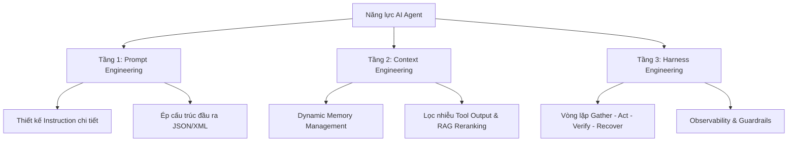

Chào anh em, nếu anh em đang đọc bài viết này, tôi cá là anh em đang ở trong một trạng thái cực kỳ quen thuộc của năm 2026: Bị bội thực thông tin về AI. Mỗi ngày mở mắt ra, anh em sẽ thấy hàng chục video, bài viết chia sẻ về một mô hình mới ra mắt, một framework kéo thả xịn sò, hay một "tuyệt kỹ công pháp" giúp xây dựng Agent trong 5 phút.

Kiến thức về AI thời nay gần như đều miễn phí, anh em có thể tìm được bất kỳ tài liệu nào ở bất kỳ đâu trên internet. Nhưng thứ tốn kém nhất, thực chất lại là thời gian và sự tập trung của chính anh em. Nếu anh em cứ đi nhặt đủ các loại công cụ ăn liền về chạy thử, thấy demo chạy mượt mà thì tưởng mình sắp phi thăng đến nơi, nhưng khi tự tay làm một dự án thực tế thì lập tức "ăn hành". 

Bài viết này là lộ trình hệ thống, đi từ gốc rễ mà tôi đã đúc rút được, giúp anh em biết mình nên bắt đầu từ đâu và nên dồn sự tập trung vào việc gì để xây dựng được những AI Agent thực sự chạy ổn định trong môi trường doanh nghiệp thực tế.

---

## 1. Cái bẫy của việc bắt đầu từ công cụ (Tool Trap)

Khi bắt đầu học AI Agent, sai lầm lớn nhất của 90% anh em là lao thẳng vào phần ngọn — tức là các công cụ và framework.

Anh em thấy người ta giới thiệu các công cụ kéo thả trực quan (Flowise, Langflow, Dify) hay các framework đình đám (LangChain, CrewAI, AutoGen). Anh em làm theo hướng dẫn, kéo vài cái hộp, nối vài mũi tên, gắn cái API key của OpenAI hay Anthropic vào, rồi chạy demo. Một con chatbot tự động tìm kiếm thông tin trên web và viết email báo cáo xuất hiện. Anh em thấy quá sướng, cảm giác như mình đã làm chủ được công nghệ đỉnh cao.

Nhưng đó chỉ là ảo ảnh của những bản demo đơn giản. Kiếp nạn thực sự chỉ bắt đầu khi anh em mang con Agent đó vào chạy trong thế giới thực với dữ liệu lớn và quy trình phức tạp:

- **Memory phình to và hỗn loạn:** Agent không nhớ được những gì cần nhớ, hoặc nhớ quá nhiều thông tin rác từ các lượt hội thoại trước đó, dẫn đến việc suy luận sai lệch.
- **Hành vi ảo giác (Hallucination) tăng vọt:** Mô hình bắt đầu tự bịa ra thông tin để trả lời khi bối cảnh (context) quá phức tạp hoặc bị quá tải.
- **Gọi sai Tool liên tục:** Agent gọi nhầm công cụ, truyền sai tham số API, hoặc rơi vào vòng lặp vô hạn (infinite loop) tự gọi đi gọi lại một công cụ mà không thể đưa ra kết quả cuối cùng.
- **Không thể gỡ lỗi (Debug):** Khi hệ thống bị hỏng, anh em hoàn toàn bất lực. Anh em không biết lỗi nằm ở đâu: do Prompt thiết kế tệ? Do Context nạp vào quá nhiều rác? Do Tool hoạt động không ổn định? Hay do bản thân framework tự xử lý ngầm bị lỗi?

Lao vào học công cụ trước khi hiểu bản chất giống như việc anh em học lái xe F1 khi chưa biết luật giao thông đường bộ và chưa hiểu động cơ hoạt động ra sao. Khi đường đua bằng phẳng thì không sao, nhưng chỉ cần một khúc cua ngặt nghèo (dữ liệu thực tế phức tạp), chiếc xe sẽ lập tức lao ra khỏi quỹ đạo.

---

## 2. Bản đồ tư duy 3 tầng năng lực cốt lõi (The 3 Layers of Agent Mastery)

Để xây dựng được một AI Agent có thể chạy bền vững, ổn định và mang lại giá trị thương mại thực tế, tôi khuyên anh em hãy tạm gác các framework phức tạp sang một bên và tập trung rèn luyện 3 tầng năng lực cốt lõi dưới đây. Đây là hệ thống tư duy bất biến giúp anh em đứng vững trước mọi làn sóng thay đổi công nghệ.

### Tầng 1: Prompt Engineering (Thiết kế Instruction)
Đây là tầng đầu tiên và cũng là ngôn ngữ lập trình mới của kỷ nguyên AI. Nhiệm vụ của Prompt Engineering ở cấp độ Agent không phải là viết một câu hỏi hay, mà là thiết kế một bộ khung chỉ dẫn (Instruction) cực kỳ chặt chẽ để định hình tư duy và giới hạn hành vi của mô hình. 
Anh em phải rèn luyện khả năng biến các yêu cầu mơ hồ, cảm tính của con người thành các chỉ thị logic, phân chia các bước rõ ràng (Step-by-step), ép định dạng đầu ra (Output format) và thiết lập các ràng buộc (Constraints) không thể phá vỡ.

### Tầng 2: Context Engineering (Quản lý bối cảnh thông tin)
Khi hệ thống lớn lên, chất lượng đầu ra của Agent sẽ bị quyết định phần lớn bởi bối cảnh thông tin mà nó được nhìn thấy tại thời điểm thực thi. Context window của mô hình không phải là một chiếc thùng rác để ném mọi thứ vào.
Context Engineering là nghệ thuật chọn lọc, sắp xếp, lọc nhiễu và nén thông tin từ nhiều nguồn (database, RAG, lịch sử trò chuyện, API output) để đưa vào mô hình đúng lượng thông tin cần thiết nhất, đúng vị trí ưu tiên và đúng thời điểm.

### Tầng 3: Harness Engineering (Thiết kế hệ thống bao quanh mô hình)
Đây là tầng công lực quan nhất nhưng lại bị đa số các khóa học mì ăn liền bỏ qua. Harness là lớp vỏ bọc phần mềm bằng code truyền thống (Python, TypeScript) bao quanh mô hình ngôn ngữ lớn để biến nó thành một Agent thực sự.
Harness chịu trách nhiệm lấy dữ liệu (Gather), thực thi hành động gọi API (Act), kiểm tra tính chính xác của kết quả trả về (Verify), kích hoạt cơ chế tự sửa lỗi khi mô hình đưa ra kết quả sai (Recover), và ghi log giám sát toàn bộ hành trình (Observe). Không có Harness, Agent của anh em chỉ là một chuỗi prompt chạy bằng... niềm tin.

---

## 3. Lộ trình tự học chi tiết cho năm 2026

Nếu anh em muốn tu luyện một cách nghiêm túc để trở thành người thiết kế hệ thống AI (AI System Designer) thực thụ, hãy đi theo lộ trình 4 giai đoạn sau:

### Giai đoạn 1: Master nền tảng mô hình và Prompt Engineering
Hãy bắt đầu bằng việc hiểu rõ cách hoạt động của LLM (token, xác suất, nhiệt độ - temperature). Tập viết các instruction phức tạp sử dụng các kỹ thuật như System Prompt, Few-Shot Prompting, Chain-of-Thought (CoT). Hãy thực hành ép mô hình trả về dữ liệu có cấu trúc (như JSON) một cách ổn định mà không bị lỗi cú pháp.

### Giai đoạn 2: Tự xây dựng RAG và quản lý bộ nhớ thủ công
Đừng dùng các thư viện hỗ trợ sẵn. Hãy tự tay viết code để kết nối với một Vector Database, tự thực hiện việc cắt nhỏ văn bản (chunking), nhúng vector (embedding), truy xuất tài liệu và sắp xếp thứ tự ưu tiên (Reranking). Tự thiết kế một hệ thống bộ nhớ trượt (sliding window memory) để hiểu rõ cách bối cảnh hội thoại được duy trì và dọn dẹp như thế nào.

### Giai đoạn 3: Thiết kế các vòng lặp kiểm tra và tự phục hồi (Harness cơ bản)
Viết code truyền thống để bắt các mã lỗi (error handling) khi API của LLM hoặc các công cụ bên ngoài bị sập. Thiết kế một lớp kiểm chứng (Verification Layer) để kiểm tra xem JSON trả về từ model có đúng định dạng schema không. Nếu JSON bị lỗi, hãy viết code tự động gửi lại thông báo lỗi kèm theo JSON hỏng đó để model tự sửa lại (Self-correction loop).

### Giai đoạn 4: Vận hành thực chiến và tối ưu hóa hệ thống giám sát (Observability)
Học cách tích hợp các công cụ theo dõi luồng chạy (Tracing) như LangSmith, Phoenix hoặc tự xây dựng hệ thống ghi log có cấu trúc. Phân tích chi tiết thời gian phản hồi (latency), chi phí token của từng bước chạy, và xây dựng các lớp bảo vệ (Guardrails) để giới hạn số lượt chạy tối đa của Agent, tránh trường hợp Agent rơi vào vòng lặp vô hạn gây tiêu tốn tài khoản API.

---

## Lời kết: Tập trung vào tư duy hệ thống thay vì công cụ ngắn hạn

Công cụ thay đổi theo tuần, model cập nhật theo ngày, các framework hôm nay là hot trend nhưng ngày mai có thể bị lỗi thời hoặc sáp nhập. Nhưng tư duy thiết kế hệ thống bao gồm: **Mô hình cần được chỉ dẫn thế nào? Mô hình cần nhìn thấy gì? Và hệ thống phải vận hành ra sao để đáng tin cậy?** sẽ luôn là tài sản bền vững đi theo anh em suốt sự nghiệp.

Hãy bắt đầu học từ những thứ gốc rễ nhất. Khi anh em đã làm chủ được tư duy 3 tầng này, anh em có thể tự tin sử dụng hoặc thậm chí tự viết lại bất kỳ framework nào phù hợp nhất với nhu cầu thực tế của mình.
